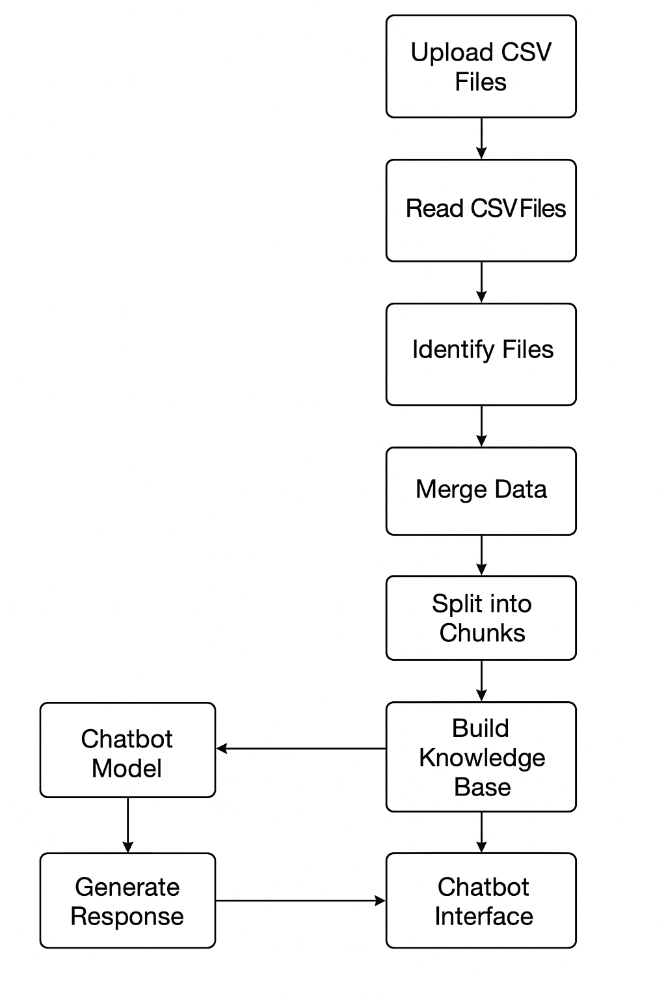

# **🏥 AI-Health-Assistant**
 ### **An AI-powered assistant that helps users understand symptoms in simple language.**
 ---

 ---
 ⚡A simple and intelligent AI-powered healthcare assistant that explains symptoms, identifies possible diseases, and provides basic precautions using a clean RAG (Retrieval-Augmented Generation) pipeline built on verified symptom–disease datasets
 ---
 ## ✨ **What This Chatbot Does**

- 🧠 **Analyzes user-entered symptoms**
- 🔍 **Retrieves relevant medical knowledge using a FAISS vector index**
- 💬 **Generates easy-to-understand explanations**
- 🦠 **Suggests possible related diseases** *(educational only — not medical advice)*
- 🛡️ **Provides basic precautions and care guidelines**
- 📂 **Built using a clean, preprocessed medical dataset**

---

## 🧱 **Tech Behind the Chatbot**

- Python, Pandas  
- Streamlit  
- LangChain  
- FAISS  
- OpenAI GPT-4 mini (API-based LLM) 
## 📌 Project Architecture (Step-by-Step)



### 1. Upload CSV files
- Users upload one or more CSV files through the Streamlit sidebar (`st.file_uploader`).
- Typical files: `DiseaseAndSymptoms.csv`, `Disease_precaution.csv`, or any structured symptom/precaution CSV.

### 2. Read CSV files — `read_csv_files(uploaded_files)`
- Each uploaded CSV is read into a Pandas DataFrame.
- The function returns a list of DataFrames ready for inspection and processing.
- Goal: convert uploaded files into consistent, in-memory tables.

### 3. Identify which file is which — `identify_files(dfs)`
- The code inspects the uploaded DataFrames and determines which contain symptom records and which contain precautions.
- This step avoids manual mapping and allows flexible file naming.
- Output: `symptoms_df` and `precautions_df`.

### 4. Merge data — `merge_symptoms_precautions(symptoms_df, precautions_df)`
- Combines symptom rows with corresponding precaution rows into a single, clean DataFrame.
- Typical operations:
  - Join on disease name or normalized keys
  - Remove duplicates
  - Normalize text (lowercase, strip whitespace)
  - Ensure every row has: `disease`, `symptoms`, `precautions`, `simplified_explanation` (if present)
- Result: `final_df` — a single source of truth for knowledge generation.

### 5. Split into chunks — `create_chunks(final_df)`
- Long text is split into smaller, meaningful “chunks” (for example, per disease or per paragraph).
- Why: LLMs and vector stores work better with reasonably sized chunks (not enormous blobs).
- Each chunk is stored with metadata (disease, original row id, source file).

### 6. Generate embeddings & build knowledge base — `build_knowledge_base(chunks_df)`
- Each chunk is converted into an embedding vector (embedding model via LangChain / chosen encoder).
- The vectors + metadata are stored in a vector index (FAISS).
- Output: `kb_index` (the persisted vector store or in-memory index).

### 7. Build retriever — `build_retriever(kb_index)`
- Wraps the FAISS index into a retriever object that can accept a user query, embed it, and return the most relevant chunks.
- Retriever settings may include: `k` (top-k results), similarity metric, and any filtering on metadata.

### 8. Create the conversational chain — `get_conversation_chain(retriever, api_key)`
- This returns a conversation (RAG) chain wired to:
  - the retriever (to fetch relevant chunks)
  - the LLM (GPT-4 mini via OpenAI API in your case)
  - memory / chat history manager (so conversation stays contextual)
- When the user types a question, the chain:
  1. Embeds the query
  2. Retrieves top chunks from FAISS
  3. Sends retrieved context + user query to the LLM with a prompt template
  4. Returns the LLM’s generated answer

### 9. Chat UI — `render_chat_ui()`
- The Streamlit front-end:
  - Displays the chat history
  - Accepts user queries
  - Calls the conversation chain to produce answers
  - Shows the LLM output (possible disease, explanation, symptoms, precautions)
- Also includes the educational warning: *not a substitute for medical advice*.

---
## 📌 Dataset Explanation

This project uses two simple and structured datasets to help the AI chatbot understand diseases, symptoms, and basic precautions. Both datasets work together to create a clean medical knowledge base for the RAG pipeline.

### 📂 **Dataset Sources**
- **Disease & Symptoms & Precautions Dataset (Kaggle)**  
  https://www.kaggle.com/datasets/choongqianzheng/disease-and-symptoms-dataset  

---
---

### 🩺 1. Disease & Symptoms Dataset
This dataset contains:
- **800+ unique diseases**
- **600+ different symptoms**
- **18 columns** (Disease + Symptom_1 to Symptom_17)

Each row represents a disease and the symptoms commonly associated with it.  
Some diseases have fewer symptoms, so unused symptom fields may contain empty values.

#### **Example Structure**
| Column | Description |
|--------|-------------|
| Disease | Name of the disease |
| Symptom_1 | First symptom |
| Symptom_2 | Second symptom |
| ... | ... |
| Symptom_17 | Seventeenth symptom |

This dataset helps the chatbot understand the relationship between symptoms and possible diseases.

---

### 🛡️ 2. Disease Precautions Dataset
This dataset contains:
- **Disease name**
- **4 basic precaution steps**

#### **Example Structure**
| Column | Description |
|--------|-------------|
| Disease | Name of the disease |
| Precaution_1 | First precaution |
| Precaution_2 | Second precaution |
| Precaution_3 | Third precaution |
| Precaution_4 | Fourth precaution |

This dataset allows the chatbot to provide simple, helpful safety guidelines for each disease.

---

### 🔗 How Both Datasets Work Together
During processing, the app:
1. Reads both CSV files  
2. Matches diseases from both datasets  
3. Combines symptoms + precautions into one clean table  
4. Converts the merged data into chunks  
5. Builds the knowledge base used by the chatbot  

This creates a **simple, structured, and reliable foundation** for generating AI responses.
---

---

## 📌 Installation Guide

Follow the steps below to set up and run the **Healthcare Symptom Explanation Chatbot** on your local machine.

---

## ✅ 1. Clone the Repository

First, download the project from GitHub:

```bash
git clone https://github.com/your-username/your-repo-name.git
```

Then navigate into the project folder:

```bash
cd src 
```
---

## ✅ 2. Create a Virtual Environment (Recommended)

A virtual environment keeps your project dependencies isolated.

### Windows
```bash
python -m venv venv
venv\Scripts\activate
```

### Mac/Linux
```bash
python3 -m venv venv
source venv/bin/activate
```

---

## ✅ 3. Install Required Dependencies

All necessary packages are listed in `requirements.txt`:

```bash
pip install -r requirements.txt
```
## 📌  How to Use the Chatbot

Using the AI-Health-Assistant is simple. Just follow these steps:

### 1️⃣ Open the App
Run the Streamlit application and wait for it to load in your browser.

### 2️⃣ Upload Your CSV Files
Upload the **Disease & Symptoms** and **Disease Precautions** CSV files from the sidebar.

### 3️⃣ Type Your Symptoms
Enter one or more symptoms into the chat box (e.g., "fever and headache").

### 4️⃣ Get Your Explanation
The chatbot will return:
- Possible disease (educational only)  
- Simple explanation  
- Key symptoms  
- Basic precautions  

⚠️ **Note:** This tool is for educational purposes only and **not** a medical diagnosis.
### 🔵 **Improvements**

- 🧠 **Multiple Model Selection (User Choice)**  
  Allow the user to select the LLM from sidebar options:
  - GPT-4 mini  
  - GPT-4o mini  
  - Llama 3 (local/offline)  
  - Mistral (open-source)  

  This shows versatility and gives users control over speed, cost, and performance.

- 📂 **Support multiple medical datasets** (nutrition, lifestyle, medications)  
- 🕒 **Save chat history in  local storage**  
- ⚡ **Better FAISS indexing settings** for faster retrieval  
- 🧩 **Add a “Recommended Questions” section** based on user’s symptoms  
- 🧪 **Symptom similarity checker** (matching user symptoms to dataset patterns)  

---

## 📌  Contact

If you would like to discuss projects, collaborations, or freelance work, feel free to reach out.

- 📧 **Email:** safi60183@gmail.com
- 💼 **LinkedIn:** https://www.linkedin.com/in/safi-ullah-10bbb927a 
- 🐙 **GitHub:** https://github.com/Safi-ullah12
---